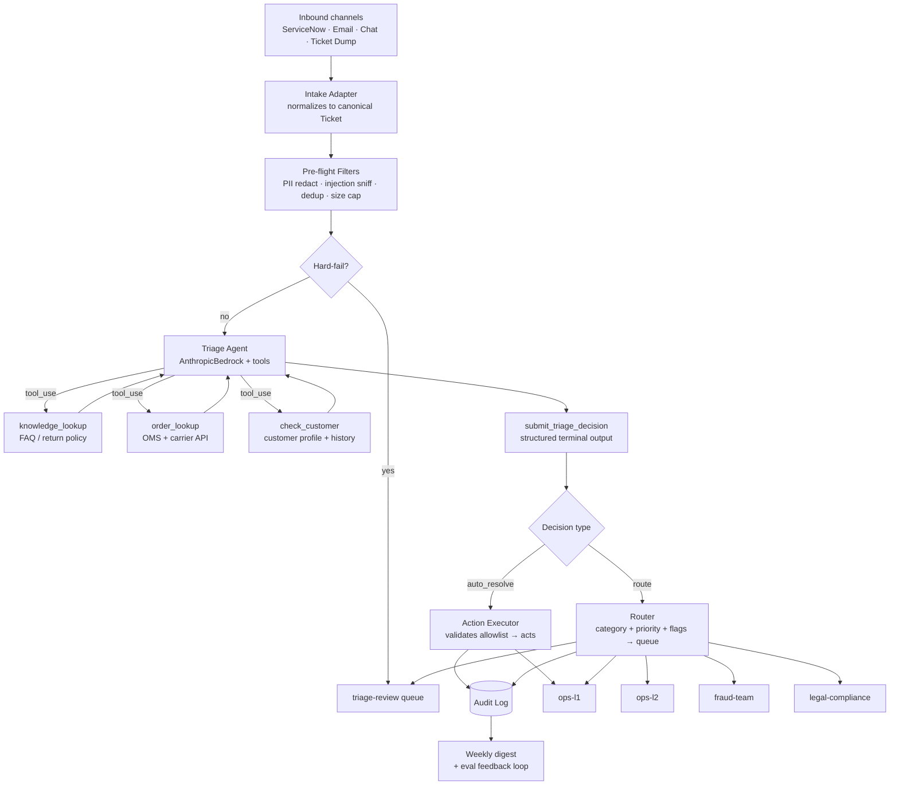

# Order Management Triage Agent — Architecture

 

**Companion to**: `mandate.md`. The mandate defines *what* the agent does. This document defines *how* it's wired.

 

---

 

## 1. System Diagram

 



 

**Three decisions worth arguing about:**

 

1. `order_lookup` and `check_customer` are separate tools — should they be one? Chosen: separate, so the agent only pulls customer history when it needs it (e.g., repeat-escalation pattern check). Reduces data exposure on simple WISMO tickets.

2. Pre-flight filters run *before* the LLM as plain Python code. Alternative: give the agent a `check_injection` tool. Chosen: upstream — ticket content can't argue its way past code-level rules.

3. The Action Executor re-validates allowlist preconditions in code after the LLM decision. The LLM doesn't get final authority on whether an action is allowed — the executor does.

 

---

 

## 2. Components

 

### 2.1 Intake Adapter

Normalizes channel-specific payloads to a single `Ticket` shape (§5.1 below). Captures: channel, sender identity (authenticated vs. anonymous), timestamps, source system metadata (ServiceNow ticket ID, email headers, etc.).

 

For batch ticket dumps (CSV/JSON), the adapter streams records one at a time into the same pipeline.

 

### 2.2 Pre-flight Filters (deterministic, no LLM)

 

| Filter | Action on trigger |

|---|---|

| **PII detector** | Redact SSN, full CC numbers, health data regex matches. Flag `pii_redacted` on ticket. Agent sees redacted copy. |

| **Duplicate/merge check** | If a ticket with same order ID + same customer is open and unresolved, merge and notify submitter. No LLM call consumed. |

| **Injection sniff** | Heuristic scan for `ignore previous instructions`, `system:`, large base64 blobs. Flag `injection_suspected`; agent receives a system-level note. |

| **Size cap** | Tickets >8 KB truncated; raw preserved in storage. |

 

### 2.3 Triage Agent

 

- **Model**: Claude Sonnet 4.6 on AWS Bedrock via `AnthropicBedrock` client.

- **System prompt**: encodes the priority matrix (P1–P4), category list, autonomous resolution allowlist, and all guardrails from the mandate. Defined in `agent/prompts.py` — single source of truth.

- **Tool-use loop**: standard multi-turn — model emits `tool_use` blocks, runtime executes, results returned, repeat until `submit_triage_decision`.

- **Hard cap**: 5 tool-use rounds maximum. If exceeded, runtime forces `route → triage-review` with flag `loop_cap_exceeded`.

- **Stateless per ticket**: no carryover between tickets. Context comes only from tools called within the current turn.

 

### 2.4 Action Executor

 

Takes `submit_triage_decision` payload and re-validates in code before acting:

 

```

if action == "auto_resolve":

    assert category in ALLOWLIST

    assert confidence >= 0.70

    assert order is not in LOCKED_STATES

    assert not customer.fraud_flagged

    execute(auto_action)

else:

    router.send(route_to, ticket, decision_payload)

```

 

The executor does **not** trust the LLM's claim that an action is allowed. It checks independently. On any assertion failure → route to `triage-review` + log `executor_override`.

 

### 2.5 Router

 

Pure function: `(category, priority, flags) → queue`. Defined as a lookup table in `agent/routing.py` — easy to unit-test, readable by ops.

 

### 2.6 Audit Log

 

Every decision writes one JSON-line record before the action takes effect. Schema in §5.3. In the demo: append-only file. In production: Kafka topic / append-only DB with retention policy.

 

---

 

## 3. Tools (LLM-Callable)

 

All tools defined with strict JSON schemas in `agent/tools.py`. The model decides *whether and when* to call them — no forced call order.

 

### 3.1 `knowledge_lookup`

 

Searches the FAQ and policy knowledge base.

 

```json

{

  "name": "knowledge_lookup",

  "description": "Search the order management knowledge base for return policies, shipping windows, and common procedures. Returns up to 3 matches with relevance scores.",

  "input_schema": {

    "type": "object",

    "properties": {

      "query": {"type": "string", "description": "Natural-language query derived from ticket text."}

    },

    "required": ["query"]

  }

}

```

 

**Returns**:

```json

{

  "matches": [

    {"id": "kb-021", "title": "Return policy — standard items", "snippet": "...", "score": 0.91}

  ]

}

```

 

### 3.2 `order_lookup`

 

Fetches real-time order and carrier status.

 

```json

{

  "name": "order_lookup",

  "description": "Look up an order's current status, tracking info, carrier, estimated delivery, and fulfillment state. Use when the ticket involves a specific order.",

  "input_schema": {

    "type": "object",

    "properties": {

      "order_id": {"type": "string"},

      "customer_id": {"type": "string", "description": "For ownership verification. Required."}

    },

    "required": ["order_id", "customer_id"]

  }

}

```

 

**Returns**:

```json

{

  "order_id": "ORD-8812",

  "status": "in_transit",

  "locked": false,

  "carrier": "FedEx",

  "tracking_number": "...",

  "estimated_delivery": "2026-05-08",

  "last_scan": "Chicago hub, 2026-05-06T09:14Z",

  "cancellation_eligible": false,

  "fulfillment_started": true

}

```

 

### 3.3 `check_customer`

 

Fetches customer profile and recent ticket history.

 

```json

{

  "name": "check_customer",

  "description": "Look up a customer's profile, fraud flag, tier, and recent ticket history. Use to detect repeat escalations or fraud-flagged accounts.",

  "input_schema": {

    "type": "object",

    "properties": {

      "customer_id": {"type": "string"}

    },

    "required": ["customer_id"]

  }

}

```

 

**Returns**:

```json

{

  "customer_id": "C-4421",

  "tier": "standard",

  "fraud_flagged": false,

  "open_tickets_48h": 1,

  "recent_categories": ["wismo"],

  "do_not_contact": false

}

```

 

### 3.4 `submit_triage_decision` (terminal)

 

The agent ends every turn by calling this exactly once. Forces structured output validated by schema — more robust than parsing free-form JSON.

 

```json

{

  "name": "submit_triage_decision",

  "description": "Final triage decision. Must be called exactly once to end the turn.",

  "input_schema": {

    "type": "object",

    "properties": {

      "category": {

        "enum": ["wismo","cancellation","return_refund","fraud","invoice","subscription","duplicate","faq","other"]

      },

      "priority": {"enum": ["P1","P2","P3","P4"]},

      "confidence": {"type": "number", "minimum": 0, "maximum": 1},

      "action": {"enum": ["auto_resolve","route"]},

      "auto_action": {

        "enum": ["wismo_response","send_tracking","resend_confirmation","cancel_order","merge_duplicate","kb_reply",null]

      },

      "route_to": {

        "enum": ["ops-l1","ops-l2","fraud-team","legal-compliance","triage-review",null]

      },

      "reasoning": {

        "type": "string",

        "description": "1-3 sentences. Cite tool results. Mention any guardrail triggered."

      },

      "guardrail_triggered": {

        "type": "string",

        "description": "Empty string if none. Otherwise the guardrail rule name from mandate §7."

      }

    },

    "required": ["category","priority","confidence","action","reasoning","guardrail_triggered"]

  }

}

```

 

---

 

## 4. Routing Table

 

Routing is deterministic code, not LLM-decided. Once category + priority + flags are known:

 

| category | priority | flags | queue |

|---|---|---|---|

| fraud | * | * | `fraud-team` |

| * | * | `legal_complaint=true` | `legal-compliance` |

| * | * | `injection_suspected` | `triage-review` |

| * | * | `confidence < 0.7` | `triage-review` |

| * | P1 | * | `ops-l2` (paged) |

| * | * | `repeat_escalation=true` | `ops-l2` |

| wismo, faq, duplicate | P3–P4 | none | `ops-l1` (or auto-resolve) |

| cancellation, return_refund, invoice | P2–P3 | none | `ops-l1` |

| cancellation | * | `fulfillment_started=true` | `ops-l2` |

| return_refund | * | `amount > 500` | `ops-l2` |

| subscription | * | none | `ops-l1` |

| other | * | * | `triage-review` |

 

If the LLM's `route_to` field disagrees with this table, the executor overrides to the table's value and logs `route_override`.

 

---

 

## 5. Data Shapes

 

### 5.1 Canonical Ticket (input)

 

```python

{

  "ticket_id": "T-9031",

  "source": "servicenow",          # or "email", "chat", "batch"

  "received_at": "2026-05-06T14:21:00Z",

  "customer_id": "C-4421",         # null if unauthenticated

  "from_verified": True,

  "subject": "...",

  "body": "...",                   # post-PII-redaction

  "order_id": "ORD-8812",         # extracted by intake adapter if present

  "flags": ["pii_redacted"]

}

```

 

### 5.2 Auto-resolve Allowlist (code-enforced)

 

```python

ALLOWLIST = {

  "wismo_response":      lambda t, o, c: o["status"] is not None and not c["fraud_flagged"],

  "send_tracking":       lambda t, o, c: o["tracking_number"] is not None and not c["fraud_flagged"],

  "resend_confirmation": lambda t, o, c: not c["fraud_flagged"],

  "cancel_order":        lambda t, o, c: o["cancellation_eligible"] and not o["locked"] and not c["fraud_flagged"],

  "merge_duplicate":     lambda t, o, c: True,

  "kb_reply":            lambda t, o, c: True,

}

```

 

### 5.3 Audit Record (output, every decision)

 

```json

{

  "audit_id": "AUD-...",

  "ticket_id": "T-9031",

  "model_id": "anthropic.claude-sonnet-4-6-...",

  "tool_calls": [...],

  "decision": { ...submit_triage_decision payload... },

  "executor_action": "wismo_response",

  "route_override": false,

  "latency_ms": 1840,

  "timestamp": "2026-05-06T14:21:02Z"

}

```

 

---

 

## 6. Failure Modes

 

| Failure | Behavior |

|---|---|

| Bedrock unavailable | Retry once; on second failure → `triage-review` with `agent_unavailable` flag |

| OMS/carrier API down | Tool returns `{"error": "unavailable"}`; agent must route, not auto-resolve |

| Loop cap exceeded (5 rounds) | Runtime forces `route → triage-review`, flag `loop_cap_exceeded` |

| `submit_triage_decision` invalid schema | Ask once for correction; on second failure → `triage-review` |

| Confidence < 0.7 | Executor blocks auto-action regardless of LLM decision field |

| Unknown order ID | `order_lookup` returns `{"found": false}`; agent must route |

| AWS creds missing (dev/demo) | Mock-mode: tools return canned data; evals still run end-to-end |

 

---

 

## 7. Deliberate Omissions

 

- **No vector store / RAG** — FAQ is a flat JSON lookup. Cheaper, deterministic, and easier to evaluate.

- **No multi-agent design** — single agent + eval harness catches regressions better than a "judge" agent.

- **No streaming** — triage is a single structured decision per ticket. No back-and-forth.

- **No in-production learning** — mandate changes go through change management. Eval feedback informs threshold tuning offline.